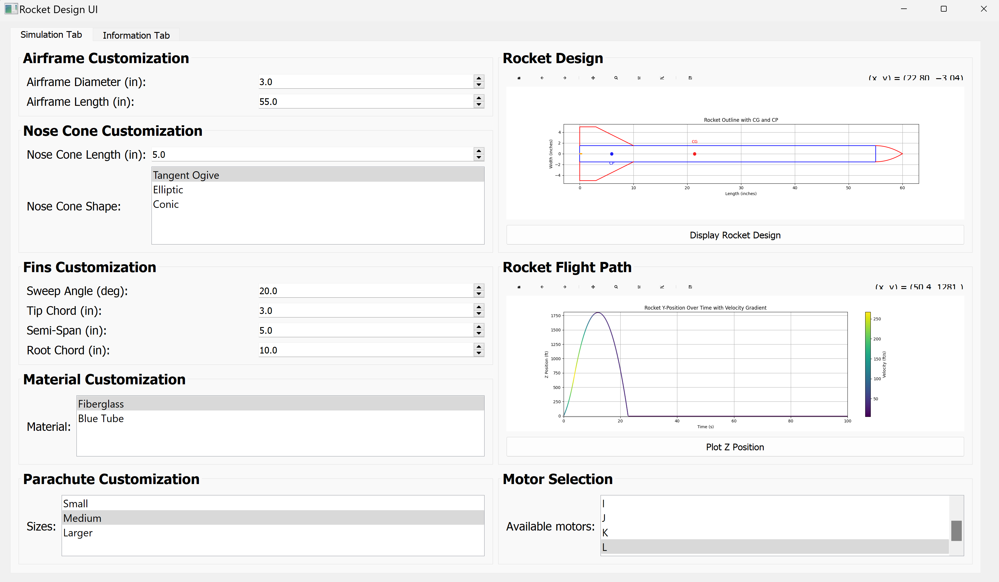
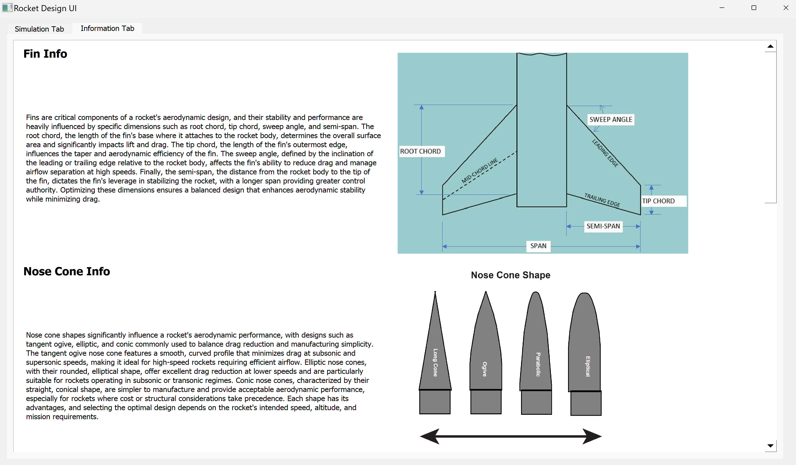
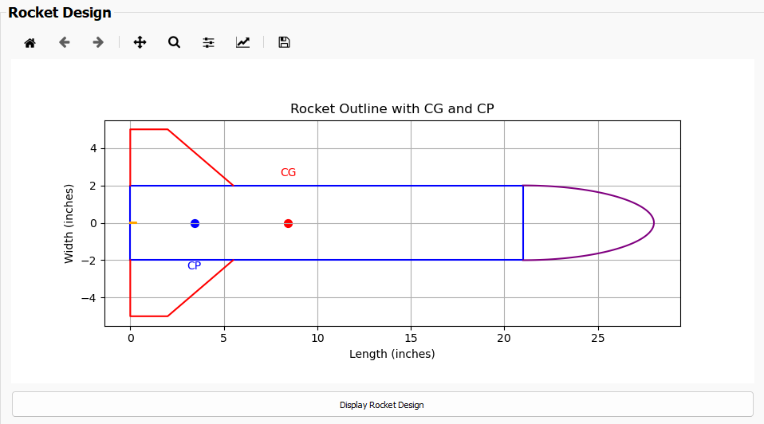
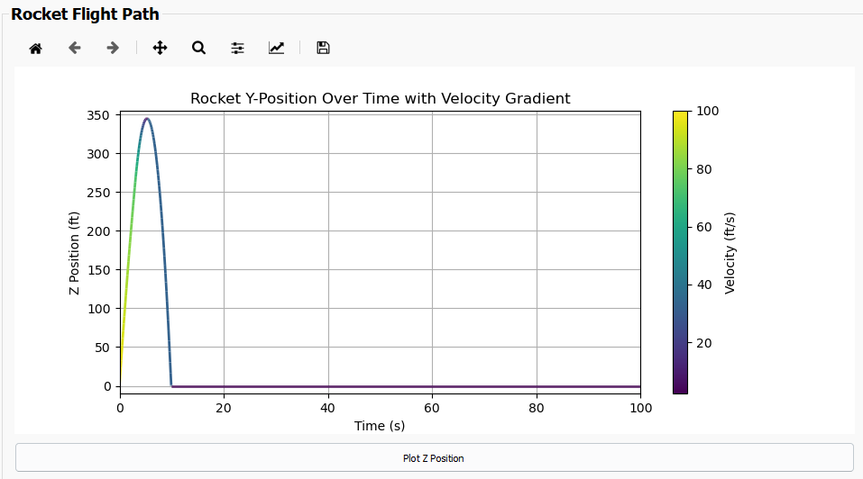
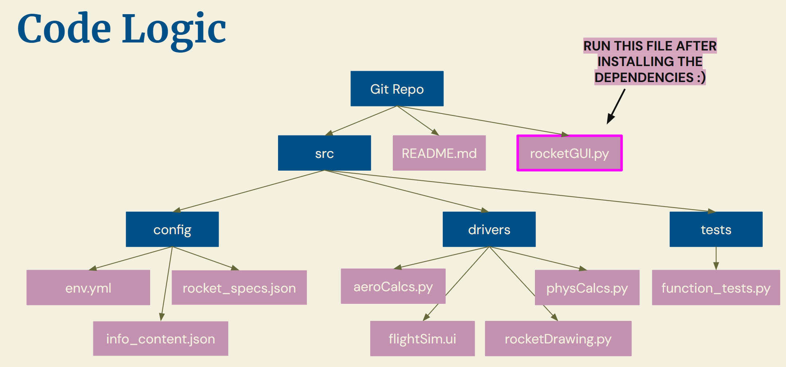

# Rocket Flight Simulation Project

## Overview

This project simulates the flight trajectory of a rocket using both **aerodynamic** and **physical** calculations based on user-defined parameters. The goal is to compute and visualize the rocket's flight path (position and velocity) from launch to landing. The simulation accounts for various factors such as airframe dimensions, motor thrust, drag, gravity, and more.

The project interacts with the user through our GUI:
- **rocketGUI**: prompts user to input rocket characteristics such as its geometry, motor class, material, and parachute diameter. The flight simulation visual will be returned to the user in this same window after the rocket parameters are used to calculate its flight path.

The GUI interacts with two primary calculation modules:
- **AeroCalcs**: Performs aerodynamic calculations (e.g., air density, drag coefficient, center of gravity).
- **PhysCalcs**: Handles the physical simulation of the rocket's flight trajectory using numerical integration (e.g., velocity, position, and mass changes).

## Features

- **Input Rocket Parameters**: Define rocket specifications in GUI.
- **Aerodynamic Calculations**: Calculate drag, center of gravity (CG), center of aerodynamic pressure (CP) and other aerodynamic properties.
- **Flight Simulation**: Simulate the rocket's ascent and descent through equations of motion.
- **Trajectory Plotting**: Provides a visual showing the rocket's flight path with position and velocity over time.
- **Info Page**: Section in GUI with more information on rocket parameter definitions for beginners.

## GUI
Below is what you'd expect the GUI to look like after running rocketGUI.py



## Required Modules
- Python 
- NumPy
- Matplotlib
- SciPy
- PyQt5
- json
- os

## Installation

1. Clone the repository: To clone the repository, run the following command:
   ```bash
   git clone https://github.com/leyas/swe4s_flight_simulator.git
2. Install the required Python dependencies: Navigate to the project directory and install the necessary dependencies by running:

    ```bash
    cd .../swe4s_flight_simulator/config

3. Set up the environment using the provided `env.yml` file:
    If you're using **conda**, you can create a virtual environment with the required dependencies by running:
    ```bash
    conda env create -f env.yml
    ```

4. Activate the environment:
    ```bash
    conda activate env.yml
    ```

5. You are now ready to run the project!

## Usage

1. After installation, run the GUI file. Please make sure you are in the correct directory: ` .../swe4s_flight_simulator` You can run the GUI by typing the following in the terminal:
    ```bash
    python rocketGUI.py
    ```

2. Correctly input values that characterize your rocket. 

3. Click "simulate flight path" when ready.

4. Observe flight simulation and record results. 

Please note, the GUI characteristic values use whatever is in the json file. So, if you press display rocket without inputting any new values, it may show you an old rendering from pre-existing values. The same goes for plot z position. Additionally, if you create a fin that is mathmatically impossible, the code will override and show the closest possible result.

For more information about rocket characteristics, please click the information tab in the top left corner. There, you can read about nose cone shapes, motor classes, rocket stability, and more!

## Example Output



## Known errors
The descent rate is not affected by parachute size as much as it should. This is a math error, and will be fixed before young rocketeers test out the code.

## Directory Tree
